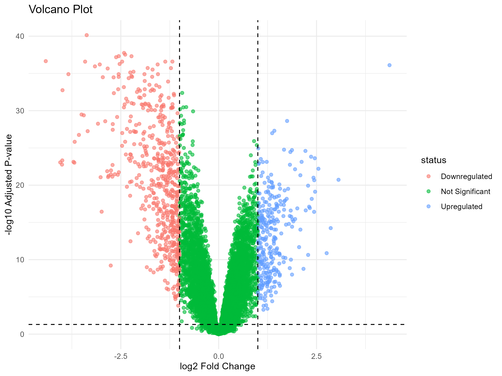
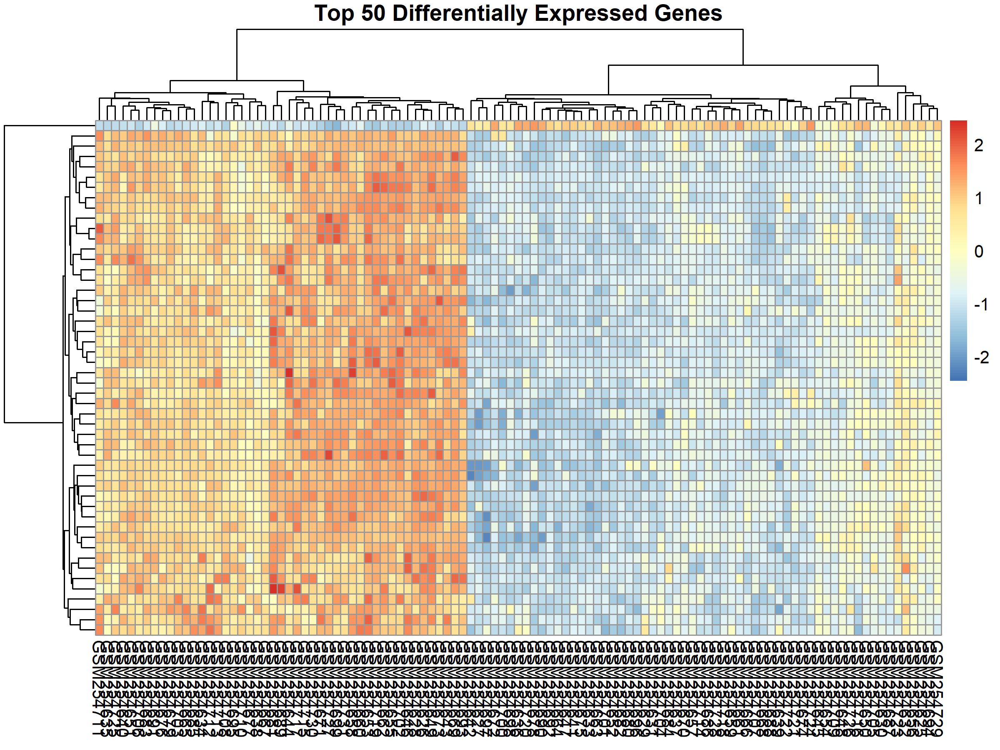
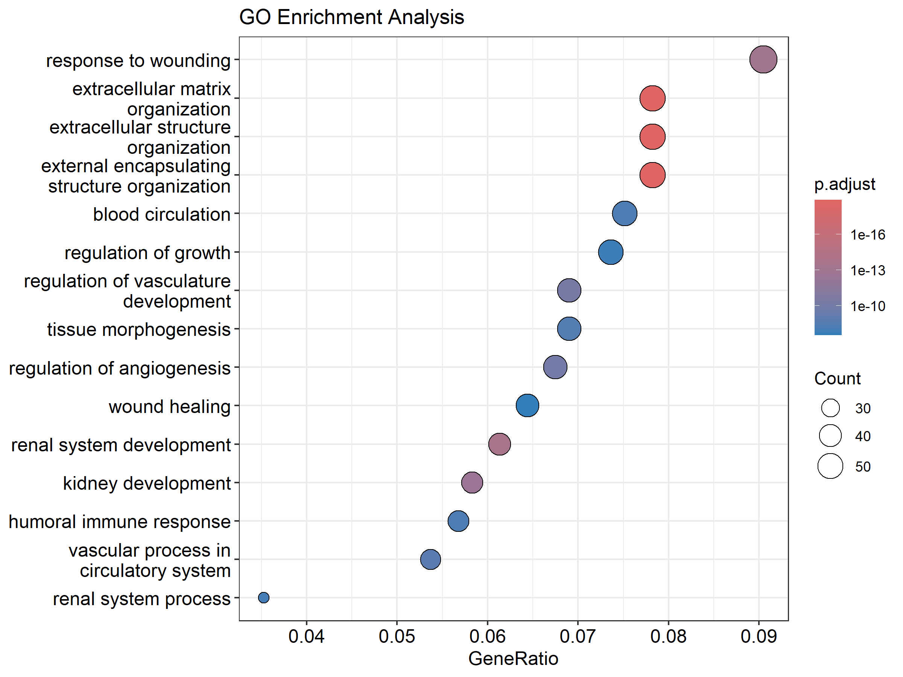
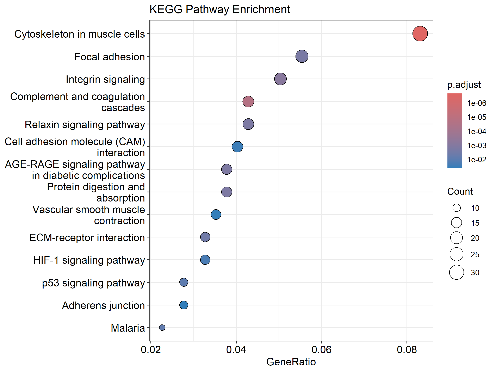

# GSE10072-DEG-Analysis
Differential expression and enrichment analysis of GSE10072
# GSE10072-DEG-Analysis

Analisis Differentially Expressed Genes (DEGs) dan enrichment pada dataset GSE10072.

## 1. Pendahuluan

Analisis ekspresi gen merupakan pendekatan penting dalam bioinformatika untuk mengidentifikasi perubahan ekspresi gen yang berkaitan dengan kondisi biologis tertentu. Differential Expression Analysis digunakan untuk mengidentifikasi gen yang menunjukkan perubahan ekspresi secara signifikan antara dua kelompok sampel.
Dataset GSE10072 digunakan dalam analisis ini untuk mengidentifikasi gen yang mengalami perubahan ekspresi antara kelompok Normal dan Tumor. Analisis dilanjutkan dengan visualisasi volcano plot dan heatmap terhadap gen yang memiliki perubahan ekspresi paling menonjol. Analisis enrichment Gene Ontology (GO) dan Kyoto Encyclopedia of Genes and Genomes (KEGG) dilakukan untuk memperoleh gambaran mengenai fungsi biologis dan jalur biologis yang berkaitan dengan gen yang mengalami perubahan ekspresi.

## 2. Metode

### 2.1 Dataset

Dataset yang digunakan adalah GSE10072 yang diperoleh dari Gene Expression Omnibus (GEO). Dataset terdiri atas sampel yang dikelompokkan menjadi dua kondisi, yaitu Normal dan Tumor.
Data ekspresi gen digunakan sebagai dasar untuk melakukan analisis Differential Expression Analysis. Informasi kelompok sampel digunakan sebagai variabel desain dalam analisis statistik.

### 2.2 Differential Expression Analysis

Analisis Differential Expression Analysis dilakukan menggunakan pendekatan berbasis linear model. Perbandingan dilakukan antara kelompok Tumor dan Normal.
Gen diklasifikasikan berdasarkan nilai p-value dan log2 fold change (logFC). Kriteria yang digunakan dalam klasifikasi DEGs adalah:
- Upregulated: adjusted p-value < 0.05 dan logFC > 1
- Downregulated: adjusted p-value < 0.05 dan logFC < -1
- Not significant: adjusted p-value ≥ 0.05 atau nilai |logFC| ≤ 1
Penyesuaian p-value dilakukan menggunakan metode Benjamini-Hochberg (BH).

### 2.3 Volcano Plot

Volcano plot digunakan untuk memvisualisasikan hubungan antara perubahan ekspresi gen dan tingkat signifikansi statistik. Sumbu-x menunjukkan nilai log2 fold change, sedangkan sumbu-y menunjukkan -log10 adjusted p-value.
Garis batas logFC ditetapkan pada -1 dan 1. Batas signifikansi statistik ditetapkan berdasarkan adjusted p-value sebesar 0.05.

### 2.4 Heatmap Top 50 DEGs

Heatmap digunakan untuk memvisualisasikan pola ekspresi 50 gen dengan perubahan ekspresi paling menonjol. Gen dipilih berdasarkan peringkat adjusted p-value dari hasil Differential Expression Analysis.

### 2.5 Gene Ontology Enrichment

Analisis Gene Ontology (GO) dilakukan terhadap gen yang mengalami perubahan ekspresi untuk mengidentifikasi kategori fungsi biologis yang mengalami enrichment. Analisis mencakup aspek Biological Process (BP), Molecular Function (MF), dan Cellular Component (CC) sesuai dengan hasil enrichment yang diperoleh.

### 2.6 KEGG Pathway Enrichment

Analisis KEGG pathway dilakukan untuk mengidentifikasi jalur biologis yang berkaitan dengan gen yang mengalami perubahan ekspresi. Hasil enrichment divisualisasikan menggunakan plot untuk menunjukkan pathway dengan tingkat enrichment yang paling relevan.

## 3. Hasil dan Interpretasi

### 3.1 Differentially Expressed Genes

Hasil klasifikasi Differentially Expressed Genes menunjukkan bahwa terdapat 297 gen yang mengalami upregulation, 562 gen yang mengalami downregulation, dan 21.424 gen yang tidak memenuhi kriteria DEGs yang digunakan dalam analisis.
Distribusi perubahan ekspresi gen divisualisasikan menggunakan volcano plot.


**Gambar 1.** Volcano plot hasil Differential Expression Analysis dataset GSE10072. Sumbu-x menunjukkan log2 fold change dan sumbu-y menunjukkan -log10 adjusted p-value. Gen diklasifikasikan berdasarkan adjusted p-value < 0.05 dan batas |logFC| > 1.

Hasil tersebut menunjukkan bahwa jumlah gen yang mengalami downregulation lebih banyak dibandingkan gen yang mengalami upregulation berdasarkan kriteria yang digunakan.

### 3.2 Top 50 Differentially Expressed Genes

Sebanyak 50 gen dengan perubahan ekspresi paling menonjol dipilih berdasarkan peringkat adjusted p-value. Pola ekspresi gen tersebut divisualisasikan menggunakan heatmap.


**Gambar 2.** Heatmap 50 Differentially Expressed Genes teratas pada dataset GSE10072.

Heatmap menunjukkan pola ekspresi relatif dari gen-gen yang termasuk dalam 50 DEGs teratas pada kelompok Normal dan Tumor. Perbedaan pola ekspresi antar kelompok menunjukkan adanya variasi ekspresi gen yang berkaitan dengan kondisi sampel.

### 3.3 Gene Ontology Enrichment

Analisis Gene Ontology dilakukan untuk mengetahui kategori fungsi biologis yang berhubungan dengan gen yang mengalami perubahan ekspresi.


**Gambar 3.** Hasil Gene Ontology enrichment pada gen yang mengalami perubahan ekspresi.

Hasil enrichment menunjukkan kategori Gene Ontology yang memiliki keterkaitan dengan gen yang dianalisis. Kategori tersebut memberikan informasi mengenai proses biologis, fungsi molekuler, dan komponen seluler yang berpotensi berkaitan dengan perbedaan ekspresi antara kelompok Normal dan Tumor.

Tabel hasil Gene Ontology enrichment tersedia pada folder `results`.

### 3.4 KEGG Pathway Enrichment

Analisis KEGG pathway dilakukan untuk mengidentifikasi jalur biologis yang berkaitan dengan gen yang mengalami perubahan ekspresi.


**Gambar 4.** Hasil KEGG pathway enrichment pada gen yang mengalami perubahan ekspresi.

Hasil KEGG enrichment memberikan gambaran mengenai pathway biologis yang berkaitan dengan perubahan ekspresi gen pada dataset GSE10072. Pathway yang menunjukkan enrichment dapat digunakan sebagai dasar untuk memahami proses biologis yang berpotensi mengalami perubahan pada kelompok Tumor dibandingkan kelompok Normal.

Tabel hasil KEGG pathway enrichment tersedia pada folder `results`.

## 4. Kesimpulan

Analisis Differential Expression pada dataset GSE10072 berhasil mengidentifikasi 297 gen yang mengalami upregulation dan 562 gen yang mengalami downregulation berdasarkan kriteria adjusted p-value < 0.05 dan |logFC| > 1.
Volcano plot digunakan untuk menggambarkan distribusi signifikansi dan perubahan ekspresi gen, sedangkan heatmap digunakan untuk menunjukkan pola ekspresi 50 DEGs teratas pada kelompok Normal dan Tumor.
Analisis Gene Ontology dan KEGG pathway menunjukkan adanya kategori fungsi biologis dan jalur biologis yang berkaitan dengan gen yang mengalami perubahan ekspresi. Hasil enrichment dapat digunakan untuk memberikan interpretasi biologis terhadap perubahan ekspresi gen yang teridentifikasi pada dataset GSE10072.

## Struktur Repository

```text
GSE10072-DEG-Analysis/
├── data/
│   ├── GSE10072_expression.csv.gz
│   └── GSE10072_metadata.csv
├── plots/
│   ├── volcano_plot.png
│   ├── heatmap_top50.png
│   ├── GO_enrichment.png
│   └── KEGG_enrichment.png
├── results/
│   ├── DEG_results.csv
│   ├── upregulated_genes.csv
│   ├── downregulated_genes.csv
│   ├── GO_enrichment_results.csv
│   ├── KEGG_enrichment_results.csv
│   └── ...
└── Bioinformatics Week 3.R
